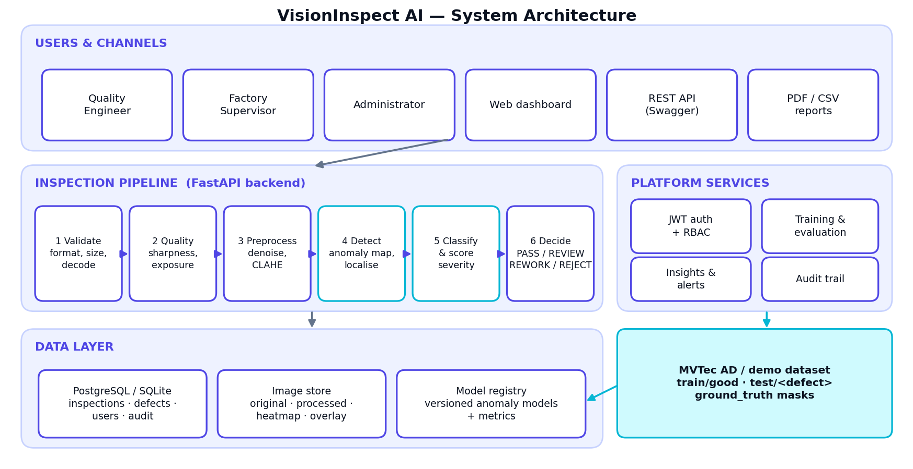

# VisionInspect AI — Technical Documentation

**Manufacturing Defect Detection & Quality Inspection System** · Version 1.0 · Milestones 1–4

## 1. Overview

VisionInspect AI is a web platform that inspects product images, detects and localises defects, classifies them,
scores their severity and produces a pass / review / rework / reject decision, with dashboards for production quality.

| Layer | Technology |
|---|---|
| Frontend | React 18, Vite, Tailwind CSS, Recharts, React Router (route-level code splitting) |
| Backend | Python 3.12, FastAPI, SQLAlchemy 2, PyJWT |
| Computer vision / ML | OpenCV, NumPy, scikit-learn |
| Database | SQLite (default, zero setup) or PostgreSQL (`DATABASE_URL`) |
| Deployment | Docker, Docker Compose, nginx; guides for AWS and Azure |
| Quality | pytest (engine + API), GitHub Actions CI |

## 2. Architecture



* **Browser → nginx → FastAPI.** nginx serves the built React app and proxies `/api` to the backend.
* **Inspection pipeline** runs synchronously per request (≈ 140 ms/image); batch uploads use a thread pool.
* **Training jobs and sample-inspection jobs** run in background threads; the UI polls `/api/dataset/jobs/{id}`.
* **Model registry:** every training run is stored as a versioned `.npz` file plus a database row with its metrics;
  one version per category is *active* and cached in memory.
* **Images** are stored on disk per inspection (`original`, `processed`, `heatmap`, `overlay`); the browser fetches them
  through authenticated endpoints.

## 3. Modules (mapping to the project brief)

| # | Brief module | Implementation |
|---|---|---|
| 1 | User management | `routers/auth.py`, `routers/users.py`, `deps.py`; roles *admin*, *quality_engineer*, *factory_supervisor* |
| 2 | Image acquisition | `routers/inspections.py` (upload, batch ≤ 50, camera simulation), `services/validation.py` |
| 3 | Image processing | `services/preprocessing.py` (resize, non-local-means denoise, CLAHE, global features), `services/quality.py` |
| 4 | Defect detection | `services/anomaly.py` (trainable patch-statistics model + baseline detector), region extraction |
| 5 | Defect classification | `services/classification.py`, `services/severity.py` |
| 6 | Quality control | `services/severity.py::decide`, review workflow, `services/reports.py` (PDF certificate, CSV) |
| 7 | Analytics dashboard | `routers/analytics.py`, `services/insights.py`, React pages Dashboard / Analytics |

## 4. Detection method

1. **Preprocess** to 256 × 256: area resize → non-local-means denoising → CLAHE on the L channel.
2. **Features:** dense patch statistics at two scales (11 px and 31 px windows, stride 4): mean L/a/b, local contrast,
   gradient magnitude, Laplacian energy and horizontal/vertical gradient energy (16 features per patch).
3. **Model (trained mode):** patches from defect-free images are standardised and clustered (k-means, k = 1–8);
   each cluster gets a Gaussian with shrinkage covariance. The anomaly score of a patch is its minimum
   Mahalanobis distance to any cluster. The threshold is calibrated on held-out good images
   (`max(mean + 3.5σ, 1.1 × max)` of their peak scores), so a normalised score of **1.0 equals the detection threshold**.
4. **Baseline mode:** with no trained model the image is compared with its own robust statistics (median/MAD +
   iteratively trimmed Mahalanobis), so the platform works from the first upload.
5. **Localisation:** threshold the smoothed map at 1.0, merge fragments, refine each blob to a tight mask using the
   local colour residual, then measure shape and appearance (elongation, solidity, circularity, lightness/colour
   contrast, edge excess, darkness, boundary sharpness).
6. **Classification:** rule scores for Scratch, Crack, Hole/Missing material, Dent/Deformation, Stain/Contamination,
   Discoloration (fallback *Surface Anomaly*). Confidence = 0.75 × detection confidence + 0.25 × type confidence,
   where detection confidence = 0.5 + 0.5·tanh(3·(peak − 1)).

## 5. Severity scoring and decisions

```
Severity = Size × 30% + Location × 25% + Defect type × 25% + Confidence × 20%     (each 0–100)
```

| Score | Level | Decision |
|---|---|---|
| 80–100 | Critical | **REJECT** — reject product, trigger inspection workflow |
| 60–79 | High | **REWORK** — repair / rework |
| 40–59 | Medium | **REVIEW** — manual inspection review |
| 0–39 | Low | **PASS** (minor cosmetic) — becomes REVIEW if any detection has < 70 % confidence |
| none | None | **PASS** |

*Size score* = `min(100, 20 + 80·√(area/4%))`; *location score* = `95 − 60·d` where *d* is the distance of the defect
centre from the image centre (0 = centre, 1 = edge); *type score* table: crack 95, hole 90, dent 65, surface anomaly 50,
stain 40, scratch 30, discoloration 30. The part-level score is the maximum over its defects.

> The brief's worked example (85, 90, 95, 92) gives **90.2** with these weights, not the 88 printed in the brief.
> The code and unit test follow the formula; the level (Critical) is the same.

## 6. Database schema

| Table | Key columns |
|---|---|
| `users` | id, email (unique), full_name, role, hashed_password, is_active, created_at, last_login |
| `inspections` | id, code (`INS-000001`), user_id, filename, source (upload/batch/camera/dataset), batch_id, category, status, width, height, validation, quality, features, preprocessing (JSON), model_name, model_mode, anomaly_score, severity_score, severity_level, decision, needs_review, recommendation, root_cause, processing_ms, gt_label, review_status/by/note/at, created_at |
| `defects` | id, inspection_id → inspections, type, category, bbox (normalised x,y,w,h), area_ratio, confidence, type_confidence, size/location/type/confidence scores, severity_score, severity_level |
| `model_versions` | id, category, name, version, path, metrics (JSON), active, trained_by, created_at |
| `audit_logs` | id, user_id, action, detail, created_at |

Indexes: `inspections.code` (unique), `created_at`, `category`, `decision`, `severity_level`, `batch_id`; `defects.inspection_id`, `defects.type`.

## 7. REST API (prefix `/api`, interactive docs at `/docs`)

| Method & path | Roles | Purpose |
|---|---|---|
| `POST /auth/register`, `POST /auth/login`, `GET /auth/me` | public / any | account + JWT |
| `GET/POST /users`, `PATCH /users/{id}`, `GET /users/audit` | admin | user & role management, audit trail |
| `POST /inspections` (multipart `files[]`, `category`) | any | inspect 1–50 images (batch if > 1) |
| `POST /inspections/camera` | any | camera simulation |
| `GET /inspections` (filters: search, decision, severity, category, source, needs_review, date range, paging) | any | history |
| `GET /inspections/{id}` · `/image/{kind}` · `/report.pdf` | any | detail, images (original/processed/heatmap/overlay), PDF certificate |
| `POST /inspections/{id}/review` | admin, supervisor | approve / rework / reject with note |
| `DELETE /inspections/{id}` | admin | delete record and files |
| `GET /inspections/export.csv` | any | production report |
| `GET /analytics/summary · trends · defect-types · severity · categories · insights` | any | dashboards |
| `GET /dataset/status`, `GET /dataset/models`, `GET /dataset/jobs[/{id}]` | any | dataset, registry, jobs |
| `POST /dataset/generate-demo`, `/dataset/train`, `/dataset/inspect-samples`, `/dataset/models/{id}/activate` | admin, engineer | data & model lifecycle |
| `GET /health` | public | liveness + database check |

## 8. Security

* Passwords: PBKDF2-HMAC-SHA256, 210 000 iterations, per-user random salt.
* Auth: signed JWT (HS256, 12 h), role checked on every protected route (`require_roles`).
* Login throttling: 8 failed attempts per IP + email per 15 minutes → HTTP 429.
* Uploads: extension allow-list, 20 MB limit, must decode as an image, minimum 64 px; path-traversal-safe category names.
* Images are served only through authenticated endpoints; response headers `X-Content-Type-Options`, `X-Frame-Options`, `Referrer-Policy`.
* Audit trail for registration, login, inspections, reviews, model training/activation and user changes.
* Production checklist: set a long random `SECRET_KEY`, change seeded passwords (or `SEED_DEMO_USERS=false`), enable HTTPS, restrict `CORS_ORIGINS`.

## 9. Optimisations (Milestone 4)

* Eager loading (`selectinload`) of defects in list/analytics queries (removes N+1 queries); single query for severity analytics.
* GZip responses, long-lived caching of built assets and images, route-level code splitting in the frontend.
* Batch uploads and dataset sampling use a thread pool (OpenCV/NumPy release the GIL).
* Active models cached in memory; model training/evaluation runs off the request thread.

## 10. Testing and validation

See `VALIDATION_REPORT.md`. Summary on held-out synthetic data: 90.6 % of defective parts detected, 0 / 90 good parts
flagged, 88 % type accuracy among detected defects, 136 ms mean processing time per image (1 core).

## 11. Deployment

See `DEPLOYMENT_GUIDE.md` (Docker Compose, AWS, Azure, HTTPS, backups).

## 12. Limitations and future work

* Validated on synthetic data only — run `scripts/validate_models.py --help` / use real MVTec AD categories next.
* Replace the patch-statistics model with PatchCore / a U-Net / YOLO behind the same `predict_map()` interface for
  pixel-accurate segmentation; replace rules with a supervised classifier trained on labelled defect folders.
* Move background jobs to a task queue (Celery/RQ + Redis) and images to object storage (S3 / Azure Blob) to scale horizontally.
* Per-product critical-zone masks for the location score; MES/PLC integration; email/SMS alerts.
