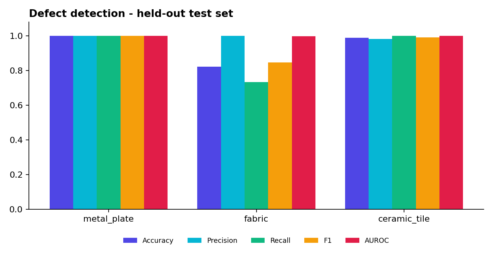
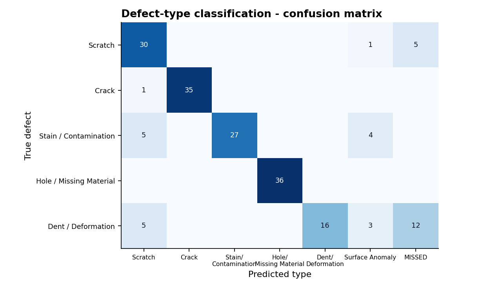

# VisionInspect AI — Validation & Performance Report (Milestone 4)

> **Scope of evidence.** All numbers below were produced by `backend/scripts/validate_models.py` on the
> **synthetic MVTec-AD-style dataset** shipped with the project (3 product categories × 5 defect types).
> They show that the pipeline works end to end and where it is weak. They are **not** results on the real MVTec AD
> dataset — re-run the script with real data before quoting accuracy figures for real products.
> Raw results: `docs/validation/validation_results.json`.

## 1. Method

| Item | Value |
|---|---|
| Categories | `demo_metal_plate` (brushed metal), `demo_fabric` (weave), `demo_ceramic_tile` (speckled tile) |
| Defect types | scratch, crack, stain, hole, dent (with ground-truth masks) |
| Training data | 60 defect-free images per category (≈48 used for fitting, ≈12 held out for threshold calibration) |
| Test data (never used for training or tuning) | per category: 30 good + 60 defective (12 per type) = 90 images → 270 total |
| Random seed | 2026 (the classifier rules were tuned on a *different* seed, 7) |
| Analysis resolution | 256 × 256 |
| Hardware for timing | 1 CPU core sandbox (a laptop will normally be faster) |

## 2. Defect detection (image level: good vs defective)

| Category | Accuracy | Precision | Recall | F1 | AUROC | False-alarm rate |
|---|---|---|---|---|---|---|
| metal_plate | 100.0% | 100.0% | 100.0% | 1.000 | 1.000 | 0.0% |
| fabric | 82.2% | 100.0% | 73.3% | 0.846 | 0.999 | 0.0% |
| ceramic_tile | 98.9% | 98.4% | 100.0% | 0.992 | 1.000 | 3.3% |

**Reading the results**

* The model separates good from defective parts almost perfectly (AUROC ≥ 0.999 everywhere). The lower fabric
  accuracy is a *threshold* effect, not a ranking problem: low-contrast **dents on the woven texture** (0 of 12
  caught) fall just under the calibrated threshold. The threshold is deliberately conservative to avoid false alarms.
* At pipeline level (after small-blob filtering and the full decision logic) **0 of 90 good parts were flagged**.
  The single ceramic false alarm in the table above is a model-level count that the pipeline's minimum-area
  filter removes.
* Overall, **163 of 180 defective parts (90.6 %) were detected**.

## 3. Defect-type classification (on the 180 defective parts)

| Metric | Value |
|---|---|
| Type accuracy among detected defects | **88.3 %** |
| Type accuracy counting missed defects as wrong | 80.0 % |
| Previous rule set (before the Milestone-4 feature work), same 163 detected defects, re-measured | 71.8 % |

| True defect | Recall |
|---|---|
| Hole / Missing material | 100.0 % |
| Crack | 97.2 % |
| Scratch | 83.3 % |
| Stain / Contamination | 75.0 % |
| Dent / Deformation | 44.4 % |

**What changed in Milestone 4:** the classifier now uses *texture-independent* features — edge density relative to
the surroundings (instead of absolute edge density, which a woven fabric inflates), a near-black "void" test using the
10th-percentile lightness (separates holes from dark stains) and the compactness of the raw heat blob (soft dents).
That raised type accuracy among detected defects from 72 % to 88 % on the held-out set. The rules were tuned on a different random seed (7) than the test set (2026).

## 4. Quality-control decisions

| True condition | PASS | REVIEW | REWORK | REJECT |
|---|---|---|---|---|
| Good (90) | **90** | 0 | 0 | 0 |
| Scratch (36) | 5 | 23 | 8 | 0 |
| Crack (36) | 0 | 1 | 31 | 4 |
| Stain (36) | 0 | 7 | 26 | 3 |
| Hole (36) | 0 | 0 | 36 | 0 |
| Dent (36) | 12 | 6 | 18 | 0 |

* No good part was rejected or sent to rework.
* Most scratches go to **REVIEW** because their detection confidence is below the 70 % rule — this is the
  designed behaviour ("confidence < 70 % requires manual review"), keeping a human in the loop for uncertain calls.
* Mean severity score by true type: crack 75.4, hole 72.7, stain 68.7, scratch 47.7, dent 43.5 — the ordering matches
  engineering intuition (structural defects score highest).

## 5. Localisation

Mean pixel IoU against ground-truth masks is ≈ 0.22. The anomaly map is smoothed (σ = 3 px at 256 px) so it marks the
*region* of the defect rather than its exact outline; bounding boxes shown in the UI come from a refined mask and are
tighter. For pixel-accurate segmentation a U-Net / PatchCore model would be needed (see Future Work).

## 6. Performance

| Metric (256 px analysis, 1 CPU core) | Value |
|---|---|
| Mean end-to-end time per image (validate → decision → images encoded) | **136 ms** |
| Median / 95th percentile / max | 132 ms / 166 ms / 204 ms |
| Sustained throughput, single worker | ≈ 7 images / second |
| Model training (≈48 images, includes evaluation) | 7–11 s per category |

The batch endpoint processes uploads with a small thread pool (`INFERENCE_WORKERS`). On the single-core test machine
this gave **no measurable speed-up** (7.0 → 7.3 img/s), as expected; the benefit on multi-core machines was **not
measured** here. Results depend on hardware — re-run `scripts/validate_models.py` on the target server.

## 7. Software tests

| Suite | Content | Status |
|---|---|---|
| `tests/test_engine.py` | severity formula (spec example), validation rules, decision rules, classifier shapes, train → evaluate (AUROC, recall, false alarms) | **Passing** (run during development) |
| `tests/test_api.py` | 15 end-to-end API tests: auth, RBAC, rate-limit, uploads (valid/invalid/batch/camera), detail/images/PDF, review workflow, filters/CSV/delete, analytics, dataset → train → inspect-samples jobs | Written; run with `cd backend && pytest` (also runs in CI) |
| Frontend | `npm run build` compiles all pages | Run in CI / locally |

## 8. Known limitations (stated openly)

1. Results are on **synthetic** data; real-world performance must be measured on MVTec AD or plant images.
2. **Dents / low-contrast defects** on textured surfaces are the weakest case (recall 44 % for type, 0 / 12 detected on fabric).
3. The classifier is **rule-based** with thresholds tuned on synthetic data; on real data it should be replaced or
   retrained with a supervised model using labelled defect folders.
4. The "location" score assumes the part centre is the functional zone; real deployments need a per-product zone map.
5. Spec note: the brief's worked example (85/90/95/92) evaluates to **90.2**, not the printed 88; the level (Critical) is unchanged.
